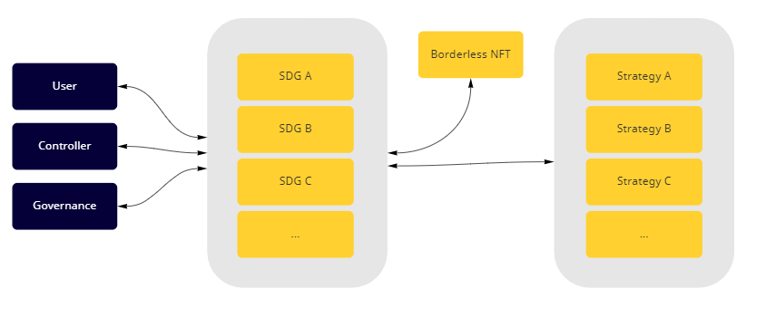
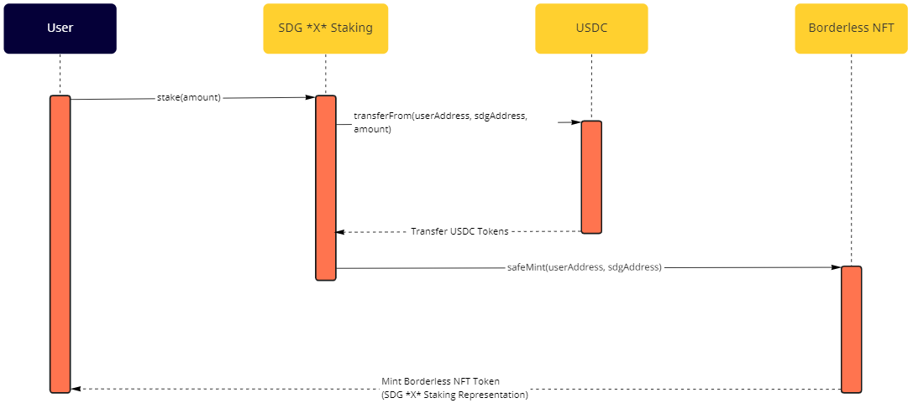
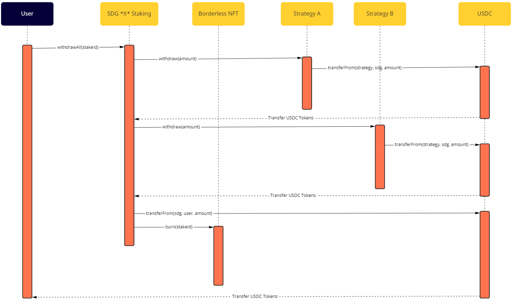
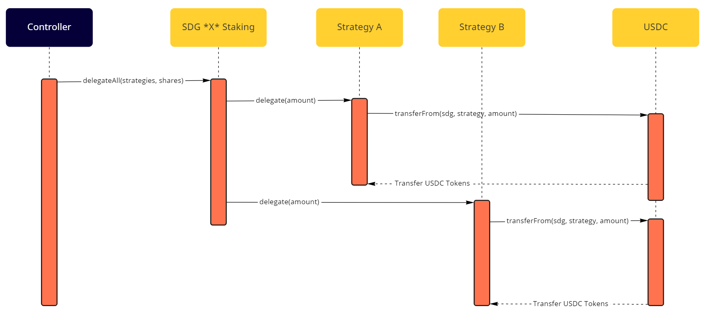

# Borderless Money Staking MVP

## Table of Contents

- [Borderless Money Staking MVP](#borderless-money-staking-mvp)
  - [Table of Contents](#table-of-contents)
  - [Overview](#overview)
  - [Architecture](#architecture)
  - [Staking](#staking)
      - [Logic of `stake`](#logic-of-stake)
      - [Errors by `stake`](#errors-by-stake)
      - [Logic of `unstake`](#logic-of-unstake)
      - [Errors by `unstake`](#errors-by-unstake)
    - [Strategies](#strategies)
    - [Stake Status](#stake-status)
    - [Delegating](#delegating)
  - [Rewards](#rewards)

## Overview

This spec outlines the architecture, implementation and usage of borderless money contracts

## Architecture

The system of staking contracts is composed of three contracts.

<p align="center"></p>

| Contract        | Description                                                                                           |
| --------------- | ----------------------------------------------------------------------------------------------------- |
| `SDGStaking`    | A Staking contract that represents a Sustainable Development Goal. It can be replicated for each SDG. |
| `Strategy`      | Implements a Yield Generator Strategy to be used at SDGs                                              |
| `BorderlessNFT` | A NFT Token contract that represents a stake at any SDG                                               |

## Staking

The staking starts by depositing USDC tokens into any of `SDGStaking` contract. Once the stake is successful, the staker receives a NFT with its representation. The diagram below illustrates this workflow.

<p align="center"></p>

Below is the interface for staking.

```solidity
/// @dev Stake USDC tokens into SDG. Tokens are stored on the SDG until its delegation to strategies.
///      Unstake to retrieve the tokens.
/// @param amount of USDC to stake.
function stake(uint256 amount) external;
```

#### Logic of `stake`

1. Transfer USDC Tokens to desired SDG Staking Contract
2. Mint Borderless NFT
3. Store stake info by tokenId
4. Emit the `Stake` event.

#### Errors by `stake`

| Error                            | Condition                                                                                                  |
| -------------------------------- | ---------------------------------------------------------------------------------------------------------- |
| StandardError("TRANSFER_FAILED") | Failed to deposit tokens into the `SDG`; likely the user had an insufficient USDC balance or not approved. |

To unstake, the tokens must be withdrawn from their strategies then sent back to user. The diagram below illustrates the unstake workflow.


<p align="center"></p>

#### Logic of `unstake`

1. Compute amount of staked USDC that can be unstaked: the `max` is the user staked amount minus losses from strategies.
2. Assert the amount to unstake is less or equal to the amount computed in (1).
3. Decrease the user's stake amount.
4. If theres no USDC remaining, burn the NFT
5. Emit the `Unstake` event.

#### Errors by `unstake`

| Error                            | Condition                                       |
| -------------------------------- | ----------------------------------------------- |
| InsufficientBalanceError         | Staked balance too low.                         |
| StandardError("TRANSFER_FAILED") | Failed to withdraw tokens from the `SVGStaking` |

### Strategies

Strategies are Yield Generator projects that aim to capture a share of stakes into SVGs. The stake amount can be delegated to any strategy and its can be withdrawn at any time.

### Stake Status

Each staked has an associated status that represents if the amount is already delegated to a strategy or not.
Every stake undelegated needs to be delegated before end epoch.

| Status      | Definition                               |
| ----------- | ---------------------------------------- |
| Undelegated | The staked USDC amount stills on the SDG |
| Delegated   | USDC is delegated to a strategy          |

### Delegating
Before ending an epoch, the undelegated USDC needs to be delegated to strategies. 
The function `delegateAll` split all remaining balance to each strategy and stores its information into respective stakes. 

The diagram below illustrates this workflow.

<p align="center"></p>

Below is the interface for delegate all

```solidity
/// @dev Move USDC tokens to strategies by splitting the remaing balance and delegating it to each strategy.
/// @param strategies of USDC to stake.
/// @param shares of USDC to stake.
function delegateAll(address[] memory strategies, uint256[] memory shares)
    external;
```

## Rewards
Each strategy follows the same interface, and generate rewards. These rewards can be withdrawn by its initiatives (TBD)

The interface is described below

```solidity
/// @dev Transfer USDC tokens to the strategy contract.
/// @param sdgAddress address of the origin SDG.
/// @param amount The amount of USDC tokens to transfer.
function delegate(address sdgAddress, uint256 amount) external;

/// @dev Withdraw USDC tokens from the strategy contract.
/// @param sdgAddress address of the origin SDG.
/// @param amount The amount of USDC tokens to withdraw.
function withdraw(address sdgAddress, uint256 amount) external;

/// @dev Compute the total rewards for the given SDG.
/// @param sdgAddress address of the SDG.
/// @return The total rewards for the given SDG.
function totalRewards(address sdgAddress) external view returns (uint256);

/// @dev Compute the total rewards collected by the given SDG.
/// @param sdgAddress address of the SDG.
/// @return The total rewards collected by the given SDG.
function collectedRewards(address sdgAddress)
    external
    view
    returns (uint256);

/// @dev Collect rewards for the given SDG.
/// @param sdgAddress address of the SDG.
function collectRewards(address sdgAddress, uint256 amount) external;
```
